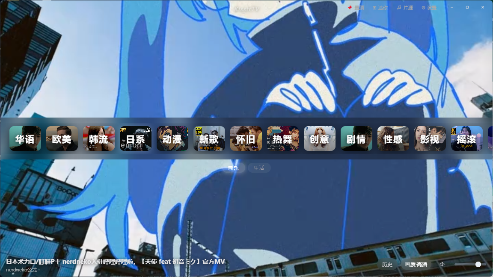

# KisstrTV

> 无边框、全屏、电台式音乐 MV 播放器 —— 永远放不完的热门精选随机播放。
> 音悦 TV 的精神续作。

KisstrTV 把「看 MV」还原成最原始的体验：打开软件，热门精选 MV 就像电台一样一首接一首自动播放，没有歌单焦虑、没有选择困难，想切频道点一下频道卡即可。

当前版本：**v1.0.4**



> 主界面：顶部为 23 个频道胶囊栏（华语 / 欧美 / 韩流 / 日系 / 动漫 / 宅舞 / 舞蹈 / ASMR / 新歌 / 怀旧 / 热舞 / 创意 / 剧情 / 性感 / 影视 / 摇滚 / 说唱 / 小清新 / 泛欧西 / Vlog / 自然 / Lofi / 合成器），下方实时显示当前曲目，控件悬停即现、移开即隐。

---

## 📦 下载

四个版本功能一致，按喜好任选 —— 见 [Releases](https://github.com/eutleek/KisstrTV/releases)。

| 版本 | 文件 | 体积 | 说明 |
|---|---|---:|---|
| 安装版 | `KisstrTV-Setup-1.0.4.exe` | 76.7 MB | NSIS 一键安装，创建桌面/开始菜单快捷方式 |
| 文件夹版 | `KisstrTV-Folder-1.0.4.zip` | 119.3 MB | **解压即用，启动最快**（推荐） |
| 便携版 | `KisstrTV-Portable-1.0.4.exe` | 76.4 MB | 单文件绿色版，随处拷贝即用（每次启动解压到临时目录，稍慢） |
| 精简版 | `KisstrTV-Lite-1.0.4.exe` | 3.0 MB | WebView2 换壳版，依赖系统 WebView2 Runtime（Win11 与多数 Win10 自带） |

前三个是 Electron 版（功能最全，自带 Chromium）；精简版体积只有 3 MB，界面完全相同。

## ✨ 特性

- **电台式随机播放**：无需建歌单，打开即播，永远放不完
- **23 个多频道精选曲库**：华语 / 欧美 / 韩流 / 日系 / 动漫 / 宅舞 / 舞蹈 / ASMR / 新歌 / 怀旧 / 热舞 / 创意 / 剧情 / 性感 / 影视 / 摇滚 / 说唱 / 小清新 / 泛欧西 / Vlog / 自然 / Lofi / 合成器，曲库按播放量精选、过滤直播切片与教程水视频
- **全屏无边框沉浸体验**：全局黑白极简 UI，控件悬停即现、移开即隐
- **系统托盘驻留**：点 ✕ 最小化到托盘并自动暂停，右键托盘可真正退出
- **迷你悬浮窗**：主窗与迷你窗均严格锁定 16:9
- **丝滑等比缩放**：OS 原生 setAspectRatio 实时联动宽高，拖拽缩放零跳变
- **失效源真删**：解析确认「稿件不存在」才移出曲库；限流、断网、412 等一律只跳过
- **B站 / 网易云账号登录**：登录后可解锁账号相关能力（桌面 UA 渲染 + 登录页缓存修复）

## 🖱 交互约定

| 操作 | 效果 |
|---|---|
| 单击视频 | 暂停 / 播放 |
| 双击视频 | 最大化 / 还原 |
| 点击频道卡片 | 切换频道并起播（点当前频道不换片） |
| 拖拽画面 / 顶栏空白 | 移动窗口 |
| 拖拽四角 | 等比缩放窗口（松手自动归正 16:9） |
| 点 ✕ | 最小化到托盘（自动暂停） |
| 点 ─（最小化到任务栏） | 继续播放，声音不中断 |
| 托盘右键 → 退出 | 真正退出程序 |

## 📁 仓库结构

```
index.html        界面（单页应用，Electron 与 WebView2 共用同一份，逐字节相同）
main.js           Electron 主进程：曲库 IPC、B站/网易云解析、失败语义分类
preload.js        暴露给渲染层的 API
package.json      依赖与 electron-builder 配置
assets/           图标全套（png 16~512 + 多帧 ico）+ preview.png（界面预览图）

webview2/         WebView2 换壳版源码（C#，编出约 3 MB 单文件）
  src/            index.html + assets（唯一真源）
  build/          main.cs / core.cs / services.cs / build.bat（三个 DLL 自行准备）
  compare/        行为比对与验证脚本
```

## 🛠 从源码构建

### Electron 版

```bash
npm install        # Electron ^31.7.7 + electron-builder ^24.13.3
npm run dist       # 输出 portable + nsis 安装包到 release/
```

Windows 下首次打包建议预置 `winCodeSign` 缓存（electron-builder 的 tar 包含 Unix symlink，Windows 直连常失败）：

1. 下载 `winCodeSign-2.6.0.zip`（选 zip 版）：
   `https://github.com/electron-userland/electron-builder-binaries/releases/download/winCodeSign-2.6.0/winCodeSign-2.6.0.zip`
2. 解压到 `%LOCALAPPDATA%\electron-builder\Cache\winCodeSign\winCodeSign-2.6.0\`

### WebView2 版

只需要 .NET Framework 4.x 自带的 `csc.exe`，无需 Visual Studio / MSBuild / SDK：

1. 从 NuGet 包 `Microsoft.Web.WebView2` 的 `build\native\x64\` 取出三个 DLL，
   放进 `webview2\build\`：
   - `Microsoft.Web.WebView2.Core.dll`
   - `Microsoft.Web.WebView2.WinForms.dll`
   - `WebView2Loader.dll`
2. 双击 `webview2\build\build.bat`

产物为 `webview2\dist\KisstrTV.exe`（HTML、图标、三个 DLL 全部内嵌为资源，单文件约 3 MB）。

> 这三个 DLL 由微软分发，因此不在本仓库内。

## 📄 License

MIT
